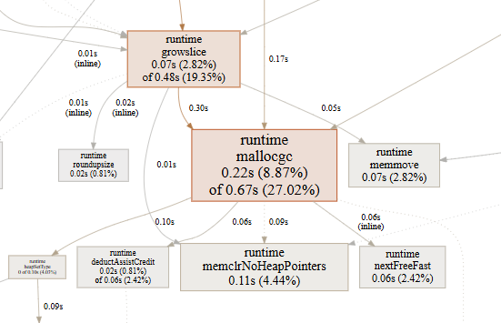
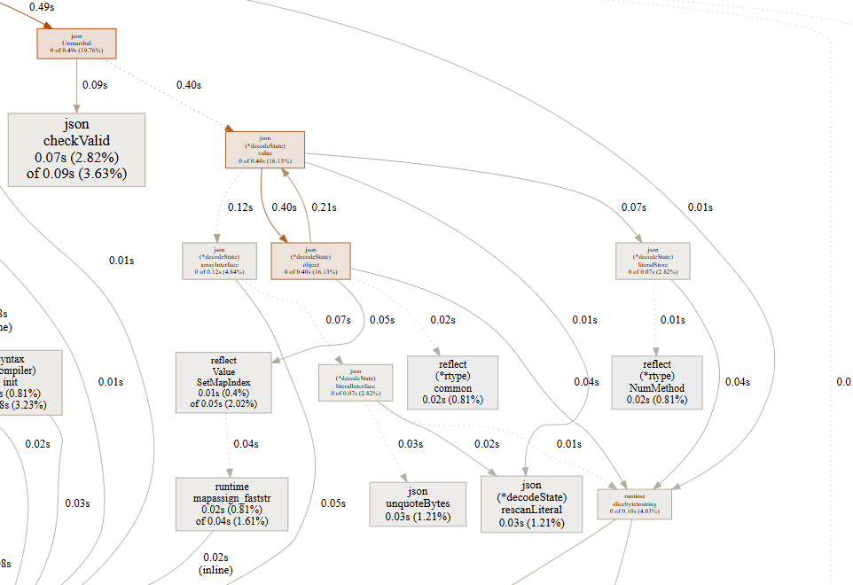
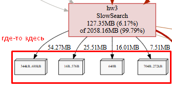

# Найденные проблемы:

## 1. Закрытие файла - mem

Не закрываем файл, что приводит к лишнему использованнию памяти до выхода из области видимости фукнции.

```go
file, err := os.Open(filePath)
if err != nil {
    panic(err)
}

fileContents, err := ioutil.ReadAll(file)
if err != nil {
    panic(err)
}
```

Решение - закрываем файл:

```go
file, err := os.Open(filePath)
if err != nil {
    panic(err)
}

fileContents, err := ioutil.ReadAll(file)
if err != nil {
    panic(err)
}

file.Close()
```

## 2. Выделение памяти под слайсы - cpu

При инициализации слайса не указываем capacity, хотя явно знаем итоговый размер, что приводит к повторной аллокации памяти в рантайме.

```go
users := make([]map[string]interface{}, 0)
for _, line := range lines {
    user := make(map[string]interface{})
    // unmarshall
    users = append(users, user)
}
```



Решение - указываем capacity при инициализации:

```go
users := make([]map[string]interface{}, 0, len(lines))
for _, line := range lines {
    user := make(map[string]interface{})
    // unmarshall
    users = append(users, user)
}
```

## 3. Анмаршалинг json - cpu

Анмаршаллинг через стандартную библиотеку обращается к рефлекту для выставления полей структуры, что негативно сказывается на производительности:


```go
user := make(map[string]interface{})
err := json.Unmarshal([]byte(line), &user)
if err != nil {
    panic(err)
}
users = append(users, user)
```




Решение - создаем структуру `User`, генерируем для нее код через easyjson, пользуемся `easyjson.Unmarshal`:

```go
//easyjson:json
type User struct {
	Browsers []string `json:"browsers"`
	Company string `json:"company"`
	Country string `json:"country"`
	Email string `json:"email"`
	Job string `json:"job"`
	Name string `json:"name"`
	Phone string `json:"phone"`
}
```

```go
users := make([]User, 0, len(lines))
for _, line := range lines {
    var user User
    err := easyjson.Unmarshal([]byte(line), &user)
    if err != nil {
        panic(err)
    }
    users = append(users, user)
}
```

## 4. Поиск подстроки - cpu

Используем регулярное выражение (которое еще и компилируется заново на каждой итерации цикла) для поиска подстроки в строке - можно оптимизировать.


```go
for _, browser := range browsers {
    if ok, err := regexp.MatchString("Android", browser); ok && err == nil {
        // do
    }
}
```

```go
for _, browser := range browsers {
    if ok, err := regexp.MatchString("MSIE", browser); ok && err == nil {
        // do
    }
}
```


Решение - применяем `strings.Contains` для поиска подстроки (работает, потому что по сути `strings` использует линейный алгоритм поиска вроде KMP, а `regex` строит конечный автомат на каждой итерации):

```go
for _, browser := range browsers {
    if strings.Contains(browser, "Android") {
        // do
    }
}
```

```go
for _, browser := range browsers {
    if strings.Contains(browser, "MSIE") {
        // do
    }
}
```

## 5. Поиск по cлайсу - cpu

В каждом цикле итерируемся по словарю для проверки того, что браузер уже встречался и используем два цикла вместо одного.

```
seenBrowsers := []string{}

// ...

notSeenBefore := true
for _, item := range seenBrowsers {
    if item == browser {
        notSeenBefore = false
    }
}

```


Решение - используем мап вместо словаря, по браузерам проходимся в одном цикле:


```go
seenBrowsers := make(map[string]struct{})
foundUsers := ""

for i, user := range users {

    containsAndroid := false
    containsMSIE := false

    for _, browser := range user.Browsers {
        isAndroid := strings.Contains(browser, "Android")
        containsAndroid = containsAndroid || isAndroid
        
        isMSIE := strings.Contains(browser, "MSIE")
        containsMSIE = containsMSIE || isMSIE
        
        if isAndroid || isMSIE {
            seenBrowsers[browser] = struct{}{}
        }
    }

    // ...
}
```

## 6. Конкатенация строк - mem

Для получения списка пользователей склеиваим строки через '+', но так как строки в Go иммутабельные, каждый раз выделяется новая память.

```go
foundUsers := ""
	
for i, user := range users {

    // ...

    foundUsers += fmt.Sprintf("[%d] %s <%s>\n", i, user.Name, email)
}
```




Решение - используем `strings.Builder`:

```go
var foundUsersB strings.Builder
	
for i, user := range users {
    // ...

    foundUsersB.WriteString(fmt.Sprintf("[%d] %s <%s>\n", i, user.Name, email))
}

fmt.Fprintln(out, fmt.Sprintf("found users:\n%s", foundUsers.String()))
```


## 7. Замена подстроки - cpu

Используем `regex` для замены подстроки, хотя можно `strings`

```go
r := regexp.MustCompile("@")

// ...

email := r.ReplaceAllString(user.Email, " [at] ")
```

Решение - используем `strings` и вызываем `ReplaceAll` в самом конце:


```go
for i, user := range users {
    // ...

    foundUsersB.WriteString(fmt.Sprintf("[%d] %s <%s>\n", i, user.Name, user.Email))
}

foundUsers := strings.ReplaceAll(foundUsersB.String(), "@", " [at] ")
```


# Финальный бенчмарк

```bash
$ go test -bench . -benchmem
goos: linux
goarch: amd64
pkg: hw3
cpu: Intel(R) Core(TM) i5-10400F CPU @ 2.90GHz
BenchmarkSlow-12              49          25197734 ns/op        20359640 B/op     182852 allocs/op
BenchmarkFast-12             339           3184079 ns/op         5173605 B/op      12364 allocs/op
BenchmarkSolution-8          500           2782432 ns/op         559910 B/op       10422 allocs/op
PASS
ok      hw3     2.757s
```

По итогу 2 показателя лучше чем в BenchmarkSolution * 1.2